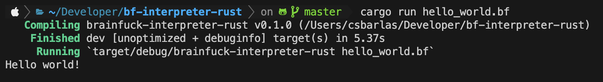

# bf-interpreter-rust
An implementation of a [Brainfuck](https://en.wikipedia.org/wiki/Brainfuck) programming language interpreter. The goal of the project was to run an application that prints "Hello, World!" to the terminal.

## Goals
✅ Minimum Viable Product: Run "Hello, World!"

✅ Create first small Rust personal project

## Installation/Usage
TDB

## Future Improvements
TBD

## Dependencies
* [Rust Toolchain](https://rust-lang.github.io/rustup/concepts/toolchains.html)

## References
* [The Rust Programming Language Book](https://doc.rust-lang.org/stable/book/)